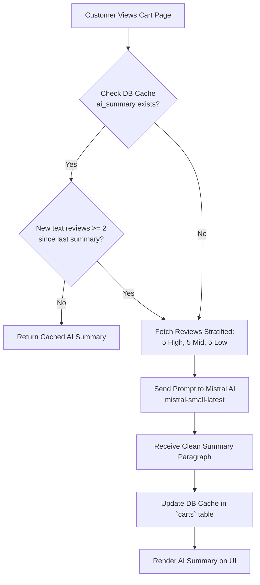
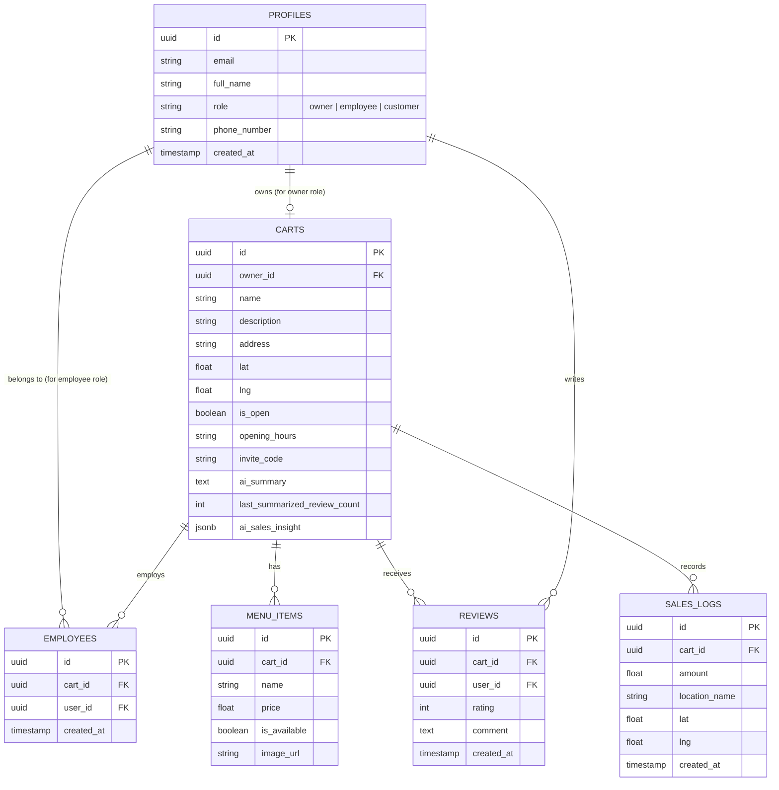

<div align="center">
  
  # 🍣 CartKoi
  
  **The ultimate platform connecting local food carts with hungry customers.**
  
  [](https://tailwindcss.com/)
  [](https://nextjs.org/)
  [](https://mistral.ai/)
  [](LICENSE)
  
</div>

<br/>

## 📖 About CartKoi

Food carts are a beloved part of local communities, but they suffer from one major problem: **discoverability**. Because they move around, customers never know exactly where they are or if they are open.

**CartKoi** solves this by providing a premium, centralized platform where:
- 🧑‍💼 **Food Cart Owners** can instantly update their live location, status, rich menu descriptions, and receive **Mistral AI-powered business analytics**.
- 🧑‍🍳 **Employees** can securely log in to help manage stock and location without needing owner credentials.
- 🍔 **Customers** can explore a live, interactive map to discover nearby food carts, view menus, see operating hours, calculate exact distances, and read **AI-generated review summaries**.

---

## ✨ Key Features

### 🗺️ For Customers (Discovery & Decision Making)
- **Live Interactive Map:** Find open food carts near you instantly using Leaflet.js.
- **Real-Time Distance Calculation:** CartKoi uses the Haversine formula to compute exactly how far away a food cart is based on your device's GPS.
- **🤖 AI Review Summaries (Mistral AI):** Automated qualitative synthesis of customer reviews (stratified sample across high/mid/low ratings) to provide an unbiased 3-4 sentence food critic summary.
- **Advanced Filtering & Search:** Client-side, ultra-fast search functionality to filter carts by name or "Open Now" status.
- **Reviews & Ratings System:** Leave star ratings with comments, protected by anti-abuse policies and server-side cache invalidation.
- **Native Sharing & Socials:** One-click Web Share API integration to easily send cart locations, plus direct links to Foodpanda, Facebook, and Instagram.

### 🏢 For Food Cart Owners (Management & AI Intelligence)
- **Role-Based Access Control (RBAC):** Secure Supabase Auth ensures owners have full control over their business and team permissions.
- **📊 AI Sales & Profitability Insights (Mistral AI):** Intelligent location-based revenue analysis that identifies top-performing spots, weakest spots, best operating windows, and actionable expansion recommendations.
- **Dynamic Dashboard:** Update menus, add food descriptions, toggle availability, manage gallery images, and set daily operating hours effortlessly.
- **Client-Side Image Compression:** Zero-dependency, hardware-accelerated image compression (via HTML5 Canvas) squashes 5MB photo uploads to ~100KB before uploading to Supabase Storage.

### 🧑‍🍳 For Employees (Operations)
- **Secure Join System:** Employees join a cart's operational team via a secure 6-character Invite Code generated by the owner.
- **Operational Control:** Employees update live GPS locations and mark items as "Sold Out" on the fly without accessing financial settings.

---

## 🤖 AI Integrations (Mistral AI)

CartKoi integrates **Mistral AI (`mistral-small-latest`)** across two key features:

1. **AI Review Summarizer (`/api/cart/[id]/summary`)**
   - Synthesizes balanced feedback by taking 5 high (4-5★), 5 medium (3★), and 5 low (1-2★) rating comments.
   - Evaluates a smart DB caching policy (`last_summarized_review_count`), triggering re-generation only when at least 2 new text reviews accumulate.

2. **AI Sales & Location Profitability (`/api/cart/[id]/sales-insights`)**
   - Processes historical sales logs (timestamp, geo-coordinates, revenue per spot).
   - Generates structured JSON output with metrics: `top_location`, `secondary_location`, `weakest_location`, `best_time`, and `recommendation`.

---

## 🛠️ Tech Stack

<div align="center">
  
  
  
  
  
  
  
  
</div>

<br/>

- **Frontend:** Next.js 14+ (App Router), React 19, TypeScript, Tailwind CSS, Framer Motion, Lucide Icons
- **AI Integration:** Mistral AI API (`mistral-small-latest` chat completions with JSON schema enforcement)
- **Backend / Database:** Supabase (PostgreSQL with RLS policies & SQL Triggers)
- **Authentication:** Supabase Auth (Email/Password, Magic Links, Role Metadata)
- **Storage:** Supabase Storage (Buckets: `menu-items`, `cart-images`, `profiles`)
- **Mapping:** React-Leaflet (Leaflet.js)

---

## 📁 Codebase Structure

```text
CartKoi/
├── client/                      # Next.js Frontend App Router Root
│   ├── src/
│   │   ├── app/                 # Next.js App Router Pages & API Endpoints
│   │   │   ├── api/
│   │   │   │   └── cart/[id]/
│   │   │   │       ├── sales-insights/route.ts  # Mistral AI Profitability Analysis
│   │   │   │       └── summary/route.ts         # Mistral AI Review Summarizer
│   │   │   ├── cart/[id]/page.tsx               # Public Cart Profile & Review UI
│   │   │   ├── employees/                       # Employee Login & Operational Dashboard
│   │   │   ├── explore/page.tsx                 # Interactive Map & Search Discovery Page
│   │   │   ├── owners/                          # Owner Auth & Full Business Dashboard
│   │   │   ├── profile/page.tsx                 # Customer/User Profile Settings
│   │   │   └── layout.tsx                       # App Root Layout with TopBar & Auth Context
│   │   ├── components/          # Reusable UI & Business Domain Components
│   │   │   ├── MapComponent.tsx                 # Interactive Leaflet Map Wrapper
│   │   │   ├── LocationUpdater.tsx              # Live GPS Tracker component
│   │   │   ├── NavBar.tsx & TopBar.tsx           # Navigation Header Components
│   │   │   └── ui/                              # Atomic UI Primitives (Button, Skeleton, EmptyState)
│   │   ├── hooks/
│   │   │   └── useAuth.ts                       # Supabase Auth state hook & session tracking
│   │   └── utils/               # Modular pure helper functions
│   │       ├── distance.ts                      # Geolocation & Haversine distance calculations
│   │       ├── hours.ts                         # Operating hour parse & "Open Now" evaluator
│   │       ├── imageCompression.ts              # Client-side HTML5 Canvas Image Squasher
│   │       └── supabase/                        # Supabase Browser, Server, & Middleware clients
│   └── package.json
└── docs/                        # Database Schemas & Migration Scripts
    ├── database_schema.sql      # Core Schema Definitions (Tables, Keys, RLS)
    ├── auth_trigger.sql         # Trigger for automatically creating profiles on Signup
    └── migrations/              # SQL Patch files (01..09)
```

---

## 🧩 Compatibility & Module Reusability

CartKoi is architected following clean software design principles to maximize modularity and reusability:

1. **Pure Utility Modules (`client/src/utils/`)**:
   - `distance.ts`: Exports pure functions (`calculateDistance`, `formatDistance`) decoupled from React state, making geo-calculations reusable across client rendering or server pre-computation.
   - `hours.ts`: Standalone parser verifying whether a business is currently open against dynamic schedule strings.
   - `imageCompression.ts`: Framework-agnostic browser canvas module. Can be reused in any frontend project needing client-side image optimization.

2. **Decoupled API Contracts (`/api/cart/[id]/*`)**:
   - Serverless route handlers act as isolated proxy bridges between Supabase DB and Mistral AI API, preventing leak of service role keys and AI credentials to the client.

3. **Atomic UI Component Architecture**:
   - Shared atomic primitives in `src/components/ui/` (`Skeleton`, `EmptyState`, `Button`) decoupled from business domain logic.

---

## 🔄 System Flowcharts & Diagrams

### 1. 🤖 Mistral AI Review Summarizer Flow



### 2. 📊 Mistral AI Sales & Profitability Analysis Flow

```mermaid
flowchart TD
    Owner[Cart Owner Request Insights] --> API[/api/cart/id/sales-insights]
    API --> DB[(Query sales_logs table)]
    DB --> Format[Format Logs: Lat/Lng, Location Name, Revenue, Timestamp]
    Format --> Prompt[Construct System Prompt with JSON Schema]
    Prompt --> Mistral[Call Mistral AI API]
    Mistral --> Parse[Receive Structured JSON:\nTop/Weak Locations, Best Time, Recommendation]
    Parse --> CacheDB[(Cache JSON in carts.ai_sales_insight)]
    CacheDB --> Render[Render Profitability Cards on Owner Dashboard]
```

---

## 🗄️ Database Schema & Relationships



---

## 🚀 Getting Started

1. **Clone the repository**
   ```bash
   git clone https://github.com/yourusername/cartkoi.git
   cd cartkoi/client
   ```

2. **Install dependencies**
   ```bash
   npm install
   ```

3. **Set up Environment Variables**
   Create a `.env.local` file in the `client` directory:
   ```env
   NEXT_PUBLIC_SUPABASE_URL=your_supabase_url
   NEXT_PUBLIC_SUPABASE_ANON_KEY=your_supabase_anon_key
   SUPABASE_SERVICE_ROLE_KEY=your_supabase_service_role_key
   MISTRAL_API_KEY=your_mistral_ai_api_key
   ```

4. **Run Database Migrations**
   Execute SQL files located under `docs/database_schema.sql` and `docs/migrations/*.sql` in your Supabase SQL Editor.

5. **Run the development server**
   ```bash
   npm run dev
   ```
   Open [http://localhost:3000](http://localhost:3000) with your browser to view CartKoi.

---

## 📝 License

This project is licensed under the MIT License - see the [LICENSE](LICENSE) file for details.
